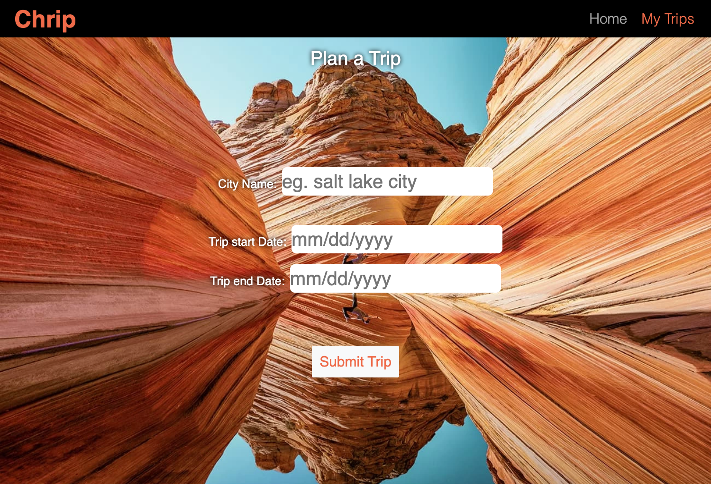

# Chirp Travel Planner

We created an app to tell you what is going on wherever and whenever you might be visiting a new place.

## Purpose

When you're travelling you want to make the most of your time. Our app will tell you what is happening and give you a list of highly rated places to visit while you're in town.

## Made with:

- HTML
- CSS
- Javascript
- jQuery
- bootstrap
- moment.js
- jQueryUi

## Website

https://dhalladay.github.io/travel-app-events/

## Usage

1. Open the website
2. Enter the name of the city you will be travelling to
3. Enter a start date (and end date if you want to search multiple days)
4. Press submit trip and you will be presented with a list of events
5. Click on any events that interest you
6. Press Save Events and you will be taken to a new page that lists your saved events
7. Come back later and click MyTrips to see your upcoming trip

## Contributions

- Dave Halladay
- Kai Whitney
- Lisseth Diaz
- Wenwen Tian

## Future functionality

- Give users the ability to search multiple pages of events
- Add the ability to save multiple trips
- Add friends to your trip
- Budget planning
- Add a packing list

